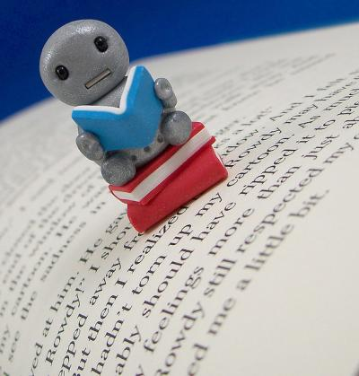

# Creating an Online Book for All Learners

~~Preamble~~

* **Generative Topic:** Creating an Online Book for *All* Learners
* **Understanding Goals:**
  * Teacher candidates will imagine themselves as a materials making teacher
  * Teacher candidates will utilize the UDL framework and Reciprocal Teaching Strategies to build a supportive reading environment
  * When was a time you persisted, felt a sense of belonging, or were open to new ways of thinking in order to succeed in a school-based learning environment?

